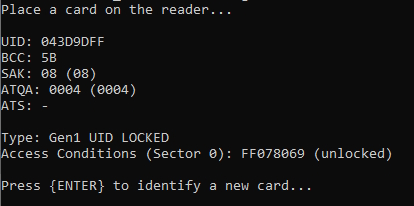
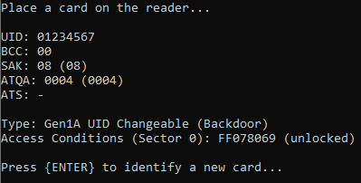
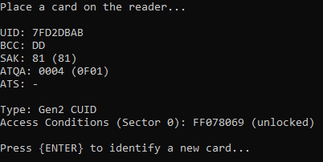

# MifareMagicCardIdentifier (MMCI)

## Overview

**MifareMagicCardIdentifier (MMCI)** supports **ACR122U** and **PN532 V2.0** NFC Reader/Writer.

It retrieves and displays the **UID**, **BCC**, **SAK**, **ATQA** and **ATS** of your Mifare Classic 1k (Magic) cards.

It also identifies the card's generation:
- **Gen1** UID LOCKED
- **Gen1A** UID Changeable (Backdoor)
- **Gen1B** UID Changeable (Backdoor)
- **Gen2** CUID

and indicates the state of the **access conditions** for Sector 0 (**locked** or **unlocked**).

## Usage

1. Download latest release of **[MifareMagicCardIdentifier](https://github.com/MirakelDev/MifareMagicCardIdentifier/releases/latest)** and **extract it**.
2. Connect the **ACR122U** or **PN532 V2.0** NFC Reader/Writer.
3. Place a **Mifare Classic 1k (Magic) card** onto the reader.
4. Run the "**MifareMagicCardIdentifier.exe**" program to get the output information for this card.
5. To scan a different card, simply place a **Mifare Classic 1k (Magic) card** onto the reader and press **Enter** to retrieve the new data.

## Screenshots

**MIFARE Classic (Gen1) aka UID Locked**

**MIFARE Classic Gen1A aka UID Changeable with Backdoor**

**MIFARE Classic DirectWrite aka Gen2 aka CUID**

> [!NOTE]
> The two values for SAK and ATQA represent the "Wake-Up" (first value) and "Block 0" (second value in brackets) swapping.
> The "Wake-Up" value is programmed into the card by the manufacturer, while the "Block 0" value is derived from the data dump stored on the tag.
> For example: `ATQA: 0004 (0F01)`. `0004` is "Wake-Up", `0F01` is "Block 0". More info here: [Mifare Classic - SAK Swapping Explained](https://gist.github.com/equipter/3022aea4e371e585ff6e46de637e7769)
