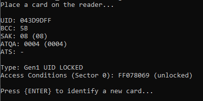
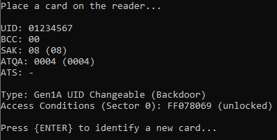
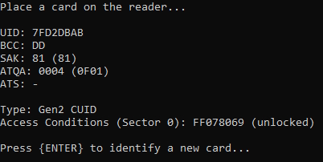

# Mifare Magic Card Identifier (MMCI)

## Overview

**Mifare Magic Card Identifier (MMCI)** supports **[ACR122U](https://skylandersnfc.github.io/Docs/Skylanders_Buying_List/Skylanders_NFC_Devices/#acr122u-all-skylanders)** and **[PN532 V2.0](https://skylandersnfc.github.io/Docs/Skylanders_Buying_List/Skylanders_NFC_Devices/#pn532-v20-all-skylanders)** NFC devices.

It retrieves and displays the **UID**, **BCC**, **SAK**, **ATQA** and **ATS** of your Mifare Classic 1k cards.

It also identifies the card's generation:
- **Gen1** UID LOCKED
- **Gen1A** UID Changeable (Backdoor)
- **Gen1B** UID Changeable (Backdoor)
- **Gen2** CUID

and indicates the state of the **access conditions** for Sector 0 (**locked** or **unlocked**).

## Usage

1. Download the **correct** **[Mifare-Magic-Card-Identifier](https://github.com/skylandersNFC/Mifare-Magic-Card-Identifier/releases)** archive for your NFC device and **extract it**.
2. Connect the **[ACR122U](https://skylandersnfc.github.io/Docs/Skylanders_Buying_List/Skylanders_NFC_Devices/#acr122u-all-skylanders)** or **[PN532 V2.0](https://skylandersnfc.github.io/Docs/Skylanders_Buying_List/Skylanders_NFC_Devices/#pn532-v20-all-skylanders)** NFC device.
3. Place a **Mifare S50 1k card** onto the reader.
4. Run the "**Mifare-Magic-Card-Identifier-XXXX.exe**" program to get the output information for this tag.
5. To scan a different tag, simply place the **new Mifare S50 1k card** on the reader and press **Enter** to retrieve the new data.

## Screenshots

**MIFARE Classic (Gen1) aka UID Locked**



**MIFARE Classic Gen1A aka UID Changeable with Backdoor**



**MIFARE Classic DirectWrite aka Gen2 aka CUID**



> [!NOTE]
> The two values for SAK and ATQA represent the "Wake-Up" (first value) and "Block 0" (second value in brackets) swapping.
> The "Wake-Up" value is programmed into the card by the manufacturer, while the "Block 0" value is derived from the data dump stored on the tag.
> For example: `ATQA: 0004 (0F01)`. `0004` is "Wake-Up", `0F01` is "Block 0". More info here: [Mifare Classic - SAK Swapping Explained](https://gist.github.com/equipter/3022aea4e371e585ff6e46de637e7769)

## Errors Explained

 - **System.Exception: Error opening NFC reader**
> [!NOTE]
> Please **connect** your **ACR122U** or **PN532 V2.0** NFC device. Ensure that you've downloaded the correct archive for your NFC device.
> 
> Also, make sure you have the proper drivers installed for your device.
> 
> For **[ACR122U](https://skylandersnfc.github.io/Docs/Skylanders_Buying_List/Skylanders_NFC_Devices/#acr122u-all-skylanders)** you need **[ACS Unified Driver MSI Win 4280.zip](https://skylandersnfc.github.io/Docs/Skylanders_Buying_List/Skylanders_NFC_Devices/ACR122U/drivers/ACS_Unified_Driver_MSI_Win_4280.zip)** driver.
> 
> For **[PN532 V2.0](https://skylandersnfc.github.io/Docs/Skylanders_Buying_List/Skylanders_NFC_Devices/#pn532-v20-all-skylanders)** you need **[CH341SER.zip](https://skylandersnfc.github.io/Docs/Skylanders_Buying_List/Skylanders_NFC_Devices/PN532/drivers/CH341SER.zip)** driver.

> [!TIP]
> For **[PN532 V2.0](https://skylandersnfc.github.io/Docs/Skylanders_Buying_List/Skylanders_NFC_Devices/#pn532-v20-all-skylanders)**, if you've followed **all the steps above** and it **still doesn't work**, I have one final **trick** for you.
> 
> Since this is a **COM port device**, typically it will use port **COM3**. However, if your machine is already connected to **another COM device** or some other _**black magic**_ was involved, the **[PN532 V2.0](https://skylandersnfc.github.io/Docs/Skylanders_Buying_List/Skylanders_NFC_Devices/#pn532-v20-all-skylanders)** might instead be assigned to **COM4** or even different port.
> 
> This **won't work** with the existing **`libnfc.conf`** configuration file, since it is set to look for a **`pn532_uart`** device on **COM3**.
> 
> You can easily check your **COM port** by opening the **Command Prompt** and typing "**`chgport`**".
> 
> In an ideal scenario, you **should see** something like this:
> 
> ```
> AUX = \DosDevices\COM1
> COM1 = \Device\Serial0
> COM3 = \Device\Serial2
> ```
> 
> However, in reality, the last row will **likely show COM4** or **another COM** port, hence your problem. You need to **note this COM port number**, then open the **`libnfc.conf`** file with **Notepad**.
> 
> **Change** the **line**:
> 
> ```ini
> device.connstring = "pn532_uart:COM3:115200"
> ```
> 
> to reflect the **correct COM port you're using**.

---

 - **System.DllNotFoundException: Unable to load DLL 'libnfc' or one of its dependencies: The specified module could not be found. (0x8007007E)**
> [!NOTE]
> **Extract** the "**Mifare-Magic-Card-Identifier-XXXX.zip**" file and **run** the "**Mifare-Magic-Card-Identifier-XXXX.exe**". Ensure it's **not run directly from the zip archive**.
